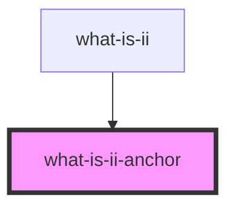

# whats-ii-anchor

<!-- Auto Generated Below -->

## Dependencies

### Used by

- [what-is-ii](../what-is-ii)

### Graph

```mermaid
graph TD;
  what-is-ii --> what-is-ii-anchor
  style what-is-ii-anchor fill:#f9f,stroke:#333,stroke-width:4px
```

---

_Built with [StencilJS](https://stenciljs.com/)_
