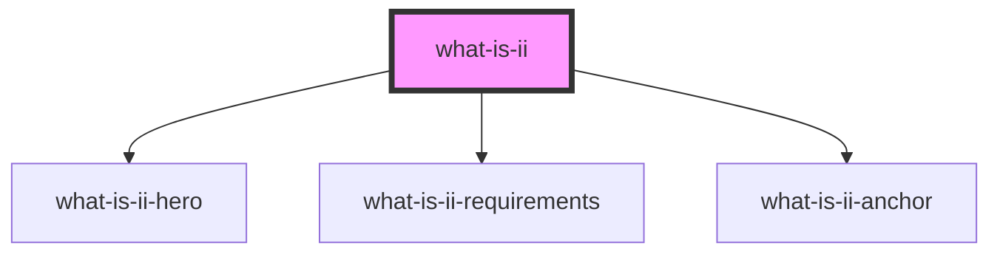

# my-component

<!-- Auto Generated Below -->

## Properties

| Property    | Attribute    | Description                                                                  | Type     | Default     |
| ----------- | ------------ | ---------------------------------------------------------------------------- | -------- | ----------- |
| `assetsDir` | `assets-dir` | In which folder are the assets - is the internet identity screenshot hosted? | `string` | `undefined` |
| `language`  | `language`   | In which language should the summary be displayed.                           | `"en"`   | `'en'`      |

## Dependencies

### Depends on

- [what-is-ii-hero](../hero)
- [what-is-ii-requirements](../requirements)
- [what-is-ii-anchor](../anchor)

### Graph

---

_Built with [StencilJS](https://stenciljs.com/)_
